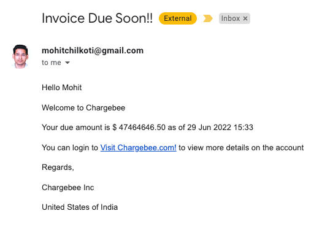
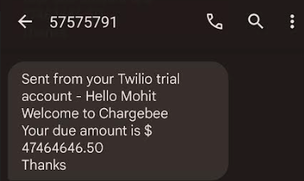

# notificationtemplateservice
Allows users to create meaningful notification templates

Notification Template Service provides four key capabilities to the users:

1. Create new templates
2. Retrieve templates by:
   1. CustomerId
   2. Template Name (TODO)
3. Update existing templates without any service downtime. The changes include (but not limited to): (TODO)
   1. Change clickable links or text content of the template
   2. Change images/videos in the template
4. Ability to have different templates based on Customer preferred communication mode for the same event.
    Example: Customer may choose to receive SMS and/or EMAIL notification when their invoice is due.  In this case, email message can contain images or videos or any additional multimedia content whereas the SMS could be a simple text message.
    
 Email  vs   SMS 
